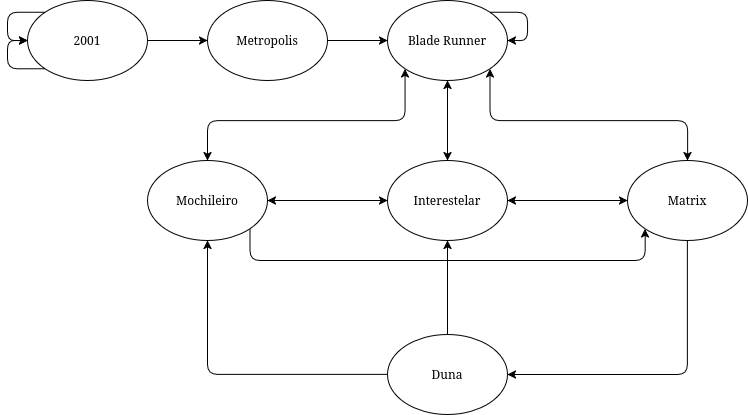

# Buscador de Filmes de Ficção Científica

Sistema de web crawler e busca para páginas sobre filmes de ficção científica, implementando algoritmo de ranking baseado em popularidade e relevância.

[Filmes de Ficção Científica](https://hmccl.github.io/search-sci-fi/)

## Relação entre as páginas

Tabela de hyperlinks entre as páginas.

| Página | Outcoming Hyperlink | Incoming Hyperlink |
| --- | --- | --- |
| 2001 | 2001, 2001, Metropolis | 2001, 2001 |
| Blade Runner | Blade Runner, Interestelar, Matrix, Mochileiro | Blade Runner, Interestelar, Matrix, Metropolis, Mochileiro |
| Duna | Interestelar, Mochileiro | Matrix |
| Interestelar | Blade Runner, Matrix, Mochileiro | Blade Runner, Duna, Matrix, Mochileiro |
| Matrix | Blade Runner, Duna, Interestelar | Blade Runner, Interestelar, Mochileiro |
| Metropolis | Blade Runner | 2001 |
| Mochileiro | Blade Runner, Interestelar, Matrix | Blade Runner, Duna, Interestelar |

Grafo de hyperlinks entre as páginas.



## Instruções

Clone o repositório e execute os seguintes comandos.

```bash
# Instala pacotes
npm install
# Serve páginas localmente (opcional)
npx http-server
# Executa o buscador
node search.js
```

### Passo a Passo

1. Insira a página inicial, por exemplo: [https://hmccl.github.io/search-sci-fi/sci-fi/2001.html](https://hmccl.github.io/search-sci-fi/sci-fi/2001.html)
2. Pesquise o termo desejado
3. Realize outra pesquisa ou pressione `CTRL+C` para finalizar a execução
